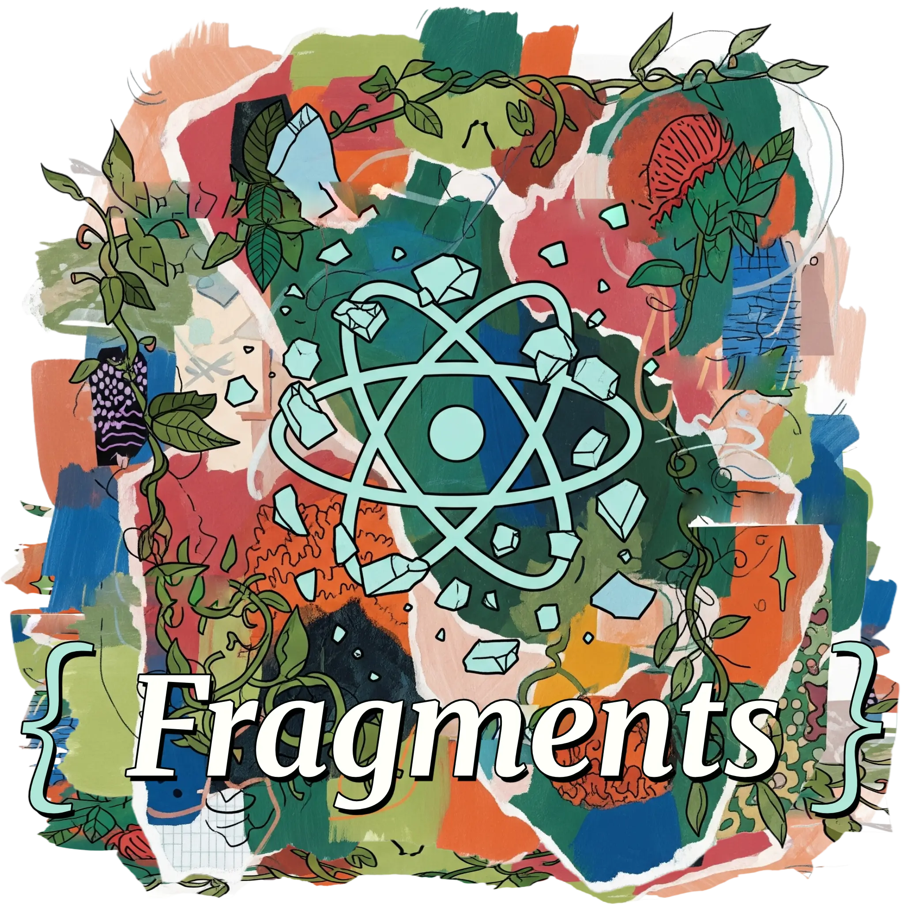

# Fragments

A simple and easy-to-use code snippets library designed for developers who want to quickly copy and paste common code patterns or better understand various technologies.

## What is fragments?

**fragments** is your go-to resource for:
- **Quick copy-paste**: Ready-to-use code snippets for common development tasks
- **Learning reference**: Understand how different technologies work through practical examples
- **Time-saving**: Skip writing boilerplate code and focus on building features

## How to use

1. **Browse** the snippets by technology or category
2. **Copy** the code you need
3. **Paste** into your project
4. **Customize** as needed for your specific use case

Perfect for developers who want to:
- Speed up development with proven code patterns
- Learn new technologies through practical examples
- Maintain a personal library of useful code fragments

## Contributing

We welcome contributions! If you have useful code snippets, improvements, or new features to add, feel free to contribute to this project. Every contribution helps make this library more valuable for the developer community.

---

**Author:** [Dariusz Sikorski](https://www.dariuszsikorski.pl)
